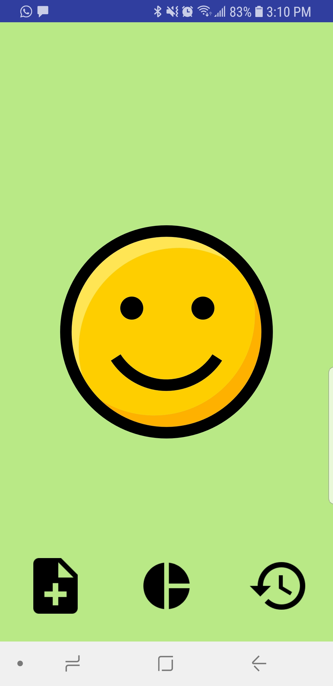

# MoodTracker
-------------
An Android app to track your daily mood.
You can 
* pick a mood everyday
* add a comment to your mood
* share your mood with your friends
* visualize your history in a list or in a pie chart
	

## Screenshots
&ensp;
------
&ensp;
------

## Library
* [Android Support Library](https://developer.android.com/topic/libraries/support-library/)
* [Gson](https://github.com/google/gson/)
* [ButterKnife](https://jakewharton.github.io/butterknife/)
* [HelloChart](https://github.com/lecho/hellocharts-android)

## Developed By

Galou Minisini

    Copyright 2018 Galou Minisini

